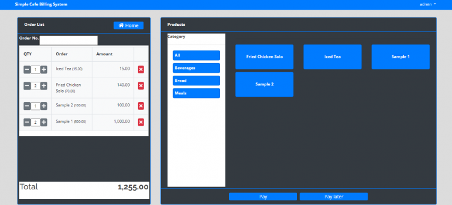

# Simple Cafe Billing System using PHP/MySQLi

### Description

The Cafe Billing System is a simple PHP/MySQLi project that can help a certain cafe or restaurant to manage its customer's bills or order and receipt. this system stores the list of menus or product that the cafe or restaurant serves with their price and the product list are organized by category.

### Features

<ul>
  <li><strong>Manage Categories</strong></li>
  <li><strong>Manage Sales</strong></li>
  <li><strong>Manage Orders</strong></li>
  <li><strong>Manage Users</strong></li>
</ul>

Visit [sourcecodester.com](https://www.sourcecodester.com/php/14569/simple-cafe-billing-system-using-phpmysqli-source-code.html) for more details about this Simple Cafe Billing System.

### Website Info

| Title | Simple Cafe Billing System using PHP/MySQLi with Source Code |
|:--|:--|
| Website | [www.sourcecodester.com](https://www.sourcecodester.com) |
| Link | https://www.sourcecodester.com/php/14569/simple-cafe-billing-system-using-phpmysqli-source-code.html |
| Language | PHP |
| Uploader/Developer | [oretnom23](https://www.sourcecodester.com/users/tips23) |
